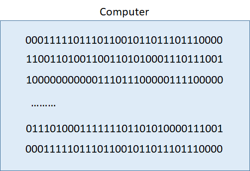
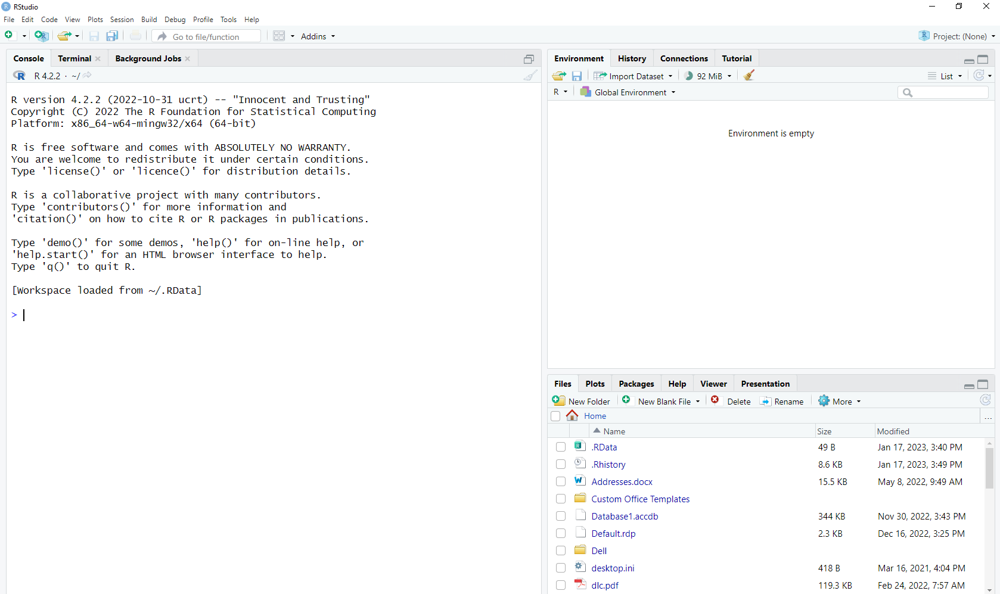
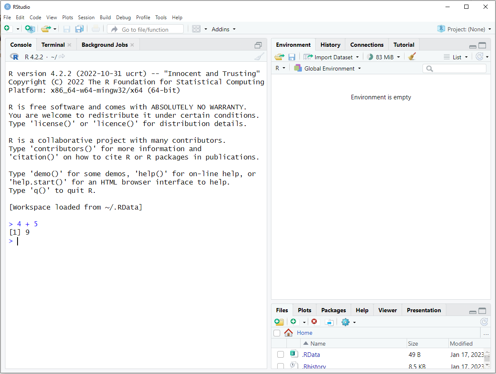
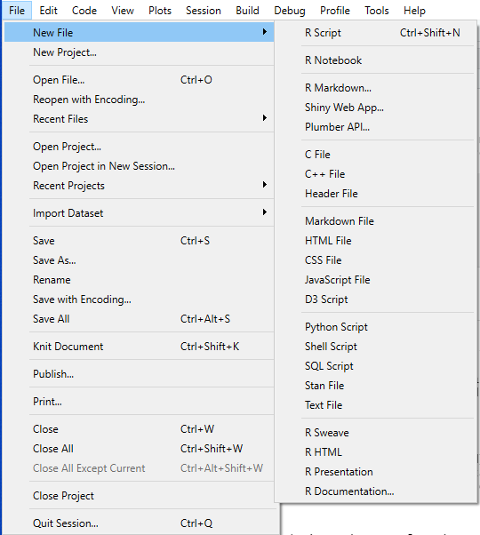
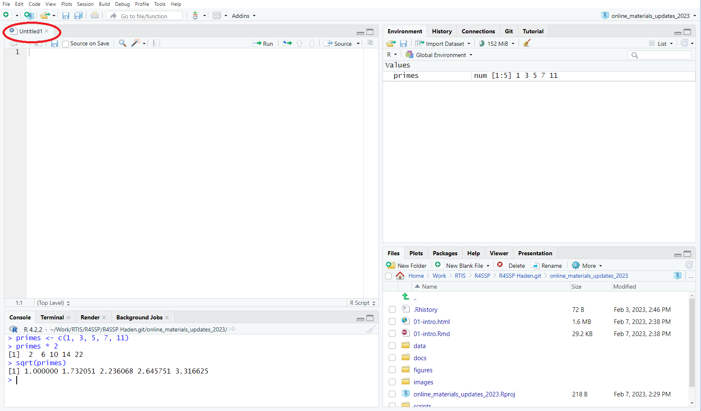
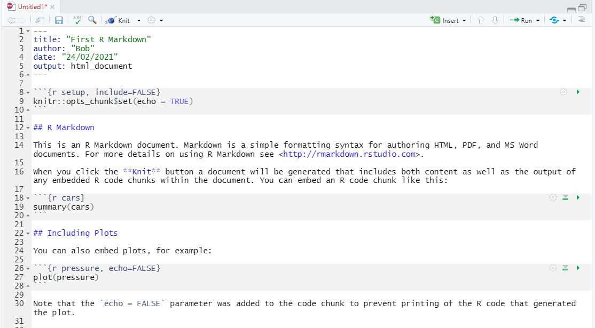

```{r setup, include=FALSE}
library(knitr)

knitr::opts_chunk$set(
  comment = "#>",
  fig.path = "figures/01/", # use only for single Rmd files
  collapse = TRUE,
  echo = TRUE
)


```


> #### Associated material
>
> Zoom notes: [Zoom notes 01 - Introducing R and RStudio](zoom_notes_01_intro.html)
> 
> Readings:
>
> - [R for Data Science - Chapter 1](https://r4ds.had.co.nz/introduction.html)
> - [R for Data Science - Chapter 4](https://r4ds.had.co.nz/workflow-basics.htm)

#### Before we start

This course is designed with two components - the module and the zoom notes. The module content provides more explanation and background so that you can work through it on your own if you wish. The zoom notes content provides the structure for the content that will be delivered in the online sessions. Both sets of content are complementary to each other.

At the top right hand corner of both the module and zoom notes pages is a "code" button. This can be used to toggle seeing/hiding the code or to download the code that that created the page as an Rmarkdown file (we cover Rmarkdown more in-depth in [module](04-communicate.html)/[zoom notes](zoom_notes_04_communicate.html) 4).


\

# Introduction

Advances in computing and sensing technologies mean that modern scientific research often involves very large data sets. There are now many computer software tools available to work with big data, and scientists from all disciplines need to be able to use them.

In this mini-course, we will help you learn to use one of the most interesting (and popular) of these tools -- the programming language R. R is a special-purpose open-source language for statistics and data analysis. Increasingly, R is the preferred tool for analysing and presenting data for student research projects.

In this module, we show you how to get started with R. We will not assume that you have any prior computer programming experience. In fact, if you have programmed before in a language like Java or C, be aware that R is, in many respects, very different from those languages -- so keep an open mind.

We will begin by explaining the different software tools you need, and how to get them onto your own computers, if you wish to do so. Then we will discuss the basic mechanics of these tools. Throughout this handout (and all materials for this mini-course) there are code examples and R exercises that you should work through carefully on the computer. This will prepare you to use R for your in-course research projects later in the semester.

This handout is designed to be read in conjunction with Chapter 1: Introduction of [R for Data Science](https://r4ds.had.co.nz).

\

\

## The Tools

We think of computers as storing rich meaningful data (mostly cat videos). Actually, what computers really contain are millions of tiny little storage units, each of which either holds an electrical charge (usually called a 1) or holds nothing (usually called a 0). Really. That's it. That's all there is.

```{r, fig.align='center', fig.cap="What's inside the computer", echo=FALSE, out.width="50%"}

```

All of the amazing things that computers do happen through extremely complicated manipulation of all those 0s and 1s.This involves a lot of maths and a lot of electronics, and is very, very confusing. So that computer users don't have to think about all these 0s and 1s, computer scientists have developed **programming languages**, which are symbolic systems that we can use to express what we want to happen inside the machine. Programming languages are designed to be similar to human languages, so they are easy for us to work with. Over the last 60 years many such languages have been developed: FORTRAN, BASIC, C, Java, Python, etc., and the one we are using in this mini-course, R. Each programming language has a vocabulary and a grammar (just like human languages) which must be followed **exactly** (they are, in fact, much stricter about this than human languages).

To communicate with your computer using a program language, you need a special computer program (previously written in a programming language, of course) that knows how to translate from the human-friendly programming language into actions on the computer. These are called **Development Environments**, because this is where people develop software.

```{r, fig.cap = "All The Parts", echo=FALSE, fig.align='center', out.width="100%"}
include_graphics("images/01-language_ide_machine.png")
```

The most popular development environment for R is a program called **RStudio**.

Both R and RStudio are installed on the computers in the Otago University computer labs. You can work through this document on those machines.

You can also install the R language and the RStudio program on your own personal computers. These are completely open-source, free, and safe.

First, install R from <https://cran.r-project.org/bin/windows/base/> (for Windows machines) or <https://cran.r-project.org/bin/macosx/> (for Mac OS machines). Then install RStudio from <https://rstudio.com/products/rstudio/download/>. Modern scientists need to be comfortable installing software on their own computers. This is a good opportunity for you to practice this important skill, and we encourage you to try it. If you need any help, ask us.

\

\

## How to Talk to a Computer

When programming a computer you must always remember one very important fact: Computers Are Stupid.

Really. The computer "understands" only a very small and *strictly limited* set of commands (the grammar and vocabulary of a programming language). If you deviate from this set of commands *in any way*, the computer cannot figure out what you mean. It is best to think of your computer as a well-meaning, well-trained, but not particularly bright dog. It wants to do as it is told, but if you use a command it doesn't know, it can't figure out what you intend. Be nice to your computer -- don't confuse it.

```{r, fig.align='center', fig.cap = "Confused Dog", echo = FALSE}
include_graphics("images/01-dog.jpg")
```

<!-- Image: https://imgflip.com/memetemplate/116235568/confused-dog -->

\

\

# Using RStudio

RStudio is a program that can accept R statements and convey them to the machine. In RStudio, you type in an R command, it is executed by the machine, and RStudio can display the results of the command, if any.

In the first instance, just to make sure R and RStudio are working correctly, we will type a few R commands directly into RStudio and execute them in real time (see below). Later, we will see how to store a set of R commands in a file so that we can run them repeatedly without having to retype.

\

## Parts of RStudio

The RStudio interface is divided into separate **panes**. As you become more comfortable with RStudio, you may wish to reorganise the locations of the different panes. In its default configuration when it first opens, RStudio will have three panes, each of which has multiple tabs. On the left is the Console pane. This is where we will enter our first R commands. At the upper right is the Environment pane. This is where we will see information about the state of our program. At the lower right is the Files pane. Here we can navigate among files on our computer. But more usefully, the Files pane contains a tab labelled Plots. We will switch to this tab to see graphs that we draw with R.

```{r, fig.align='center', fig.cap = "RStudio", echo = FALSE, fig.pos = "H", out.width="100%"}

```

### Using Projects in RStudio

RStudio projects are a great way of compartmentalising analyses. In [R for Data Science - Workflow: Projects (https://r4ds.had.co.nz/workflow-projects.html)](https://r4ds.had.co.nz/workflow-projects.html) chapter it discusses some good practices and configurations to help you work with RStudio effectively.

It is highly recommended to read this chapter and implement the suggested configuration changes.

\

\

# Parts of the R Programming Language

Programming languages have been designed to mimic human languages. Therefore most of them have **things** (like nouns) and **actions** (like verbs). Programming is just explaining to the computer in ways it can understand, what *actions* to perform on specific *things*. R understands many kinds of things and many, many kinds of actions. We are going to start with the very simplest case, just to practice interacting with RStudio (i.e., giving it R commands to convey to the computer for us).

\

## Numbers and mathematical operators

R understands numbers (things like 8 and 3.14159) and mathematical operators (actions like + and -). We will type some numbers and mathematical operators into RStudio and see how the computer responds.

\

### Code-along Exercise

1.  Launch RStudio. If you have installed R and RStudio on your own machine, you should have a Desktop (Windows) or Dock (Mac OS) icon that you can click to launch RStudio. If not, search through the Programs start-up menu (Windows) or Applications (Mac OS). Users of the Virtual Student Desktop follow <https://blogs.otago.ac.nz/studentit/student-desktop/student-desktop-own-device/> for how to access it from your computer.

2.  The Console pane on the left will contain some explanatory text. At the bottom of the text is a right angle bracket **\>**. That is where you will begin typing. There will be a small, flashing, vertical line beside the angle bracket. (If you don't have the flashing vertical line, click your mouse beside and slightly to the right of the angle bracket.)

3.  Type the following characters into the Console pane, followed by the <kbd>Enter</kbd> key.

[^1]: 

**4 + 5**

If everything is working as it should, your screen should look like this (the contents of the Files pane may be different):

```{r, fig.align='center', out.width= "100%", fig.pos="H", fig.cap = "First R Command", echo = FALSE}

```

You have given R two **things**: the number 4 and the number 5. You have asked R to perform an **action** on those things: addition. R has done so, and RStudio has displayed the result (in this case, the value 9). It has also printed [1] on the console screen. This is RStudio trying to help you. As your R commands become more complicated, you will end up with many results rather than just one. RStudio prints these numbers at the start of output lines to help you count your results. It's not really necessary when you only have one result, but that's just how RStudio behaves (we refer you again to the picture of the well-meaning doggo above).

For the remainder of this document, we will not show you pictures of the whole screen each time we enter an R command. Rather, we will display what you should type and what output you should get like this:

```{r first_command}
4 + 5
```

4.  Explore more of R's mathematical operators. For division use / and for multiplication use \*. Enter each of these R commands into the console and confirm that you receive the expected output.

```{r more maths, eval = FALSE}
10 / 8

8 * 12

6 - 12 + (3 * 7.4)
```

\

## More actions: Function calls in R

R syntax (grammar) mimics mathematical equation syntax in some respects. As we denote a function f(x) using round brackets in an equation, so do we denote the application of a function in R. R knows many useful functions. For example `sqrt()` , which computes the square root of a number, and `abs()` which computes the absolute value of a number. To apply one of these functions, we type the name, and place the value we wish to operate on **(the argument)** inside the round brackets.

### Code-along Exercise

Try these examples:

```{r applying functions}
abs(-42)

sqrt(200)

```

## Getting Help

Often you'll need help for a specific function, such as `mean()`, you can search the help documentation using `?` in front of the function name to do this (e.g. `?mean`) and this will bring up the manual page. It provides information about what does, what the arguments are, and even provides some examples that can be copy-pasted and run to give an example of what it does.

The `?` is not the only way to find out how to run a function -- for more examples of how to find help refer to <https://datacarpentry.org/R-ecology-lesson/00-before-we-start.html#Seeking_help>


\

## More things: Words

Lots of computing involves words rather than numbers. For example, searching text and enrolling students by name both operate on words. R understands words -- the concept of **things composed of letters**. However, when working with words, we must mark them with special characters to prevent R from becoming confused (we see what this confusion looks like in a moment).

In programming, a thing composed of letters doesn't have to be a real word (it could be, for example, a product code or user id), so we actually call them **strings**. To denote a **string** we surround it with quote marks, like this:

```{r strings01}
"plato"
```

There are functions that operate on strings, exactly equivalent to ones like `sqrt()` that operate on numbers. For example, R has a function `nchar()` that computes how many characters (i.e. letters) are in its string argument.

```{r strings02}
nchar("plato")
```

\

### Code-along Exercise

What do you think will happen if you give the commands below? Enter them into the RStudio console to see.

```{r strings03, error=TRUE}

nkhar("plato")

sqrt("plato")
```

Remember that the language R is a set of vocabulary and grammar rules that must be followed *very* strictly. There is no function `nkhar` in R's vocabulary, only `nchar`. And function `sqrt` only understands how to work on numbers, not on strings.

R will **never** work out what you meant when you deviate from its grammar. No programming language will. If you violate its rules, R will throw an error. But this can be very instructive. Enter the following command into RStudio and carefully consider the outcome. What does this tell you about the rules of the R language?

```{r case, error=TRUE}
NCHAR("plato")
```

We know that R understands the function `nchar` -- we saw it working just a few moments ago. But now it says it could not find that function? This is because, to R, `nchar` and `NCHAR` are not the same thing. R is a **case-sensitive** language. Upper-case and lower-case letters are completely different entities in R. When giving R commands you must always exactly match its expectations about upper and lower case (woof).

\

## Storing Results

Imagine that you have two large numbers and, for some sound scientific reason, you wish to take their ratio and then take the square root of that value. Like this:

```{r saving results 01}
198.7 / 64.5
```

```{r saving results 02}
sqrt(3.08062)
```

This operation is risky. R has given you the ratio to five accurate decimal places. But you must then be *very careful* to copy it exactly into the `sqrt` function, or your answer will be wrong. Extrapolate this to thousands of data operations on a large data set and it is certain that errors will be made.

It would be more convenient, and safer, to take the result R gave you from the first statement, *store it somewhere, and then pass the stored entity to function sqrt*. This is, in fact, a fundamental action in programming: **We can store values as named entities (called variables) and use them whenever and wherever we need them.**

In R, this "storing" is performed with the **\<- operator** (called the "assignment" operator). The assignment operator is formed by typing a left angle bracket and a hyphen. In the following code example, we demonstrate the assignment operator. We also demonstrate **comments**. In R, any text that is prefaced with \# is ignored rather than being treated as a command. It is just text that the programmer adds for their own benefit.

\

### Code-along Exercise

Make sure you can duplicate this code, with the same results, in RStudio (you don't need to type the comments).

```{r variables01}
# Store the result of the division in an entity (a variable) named ratio. We
# always use meaningful variable names.
ratio <- 198.7 / 64.5  

# This will display the value of the variable named ratio. That's what R does
# when you enter a lone variable name.
ratio 

# This will pass the value of ratio as the argument to the sqrt function.
sqrt(ratio)  
```

\

## Variable Names and Values

Look **very carefully** at the variable name on the left hand side of the assignment operator \<-. It is a string of characters, but **it is not surrounded by quote marks**. This is how, in R, we distinguish strings (a word thing -- remember, like "plato") from variable names.

Inside our computer, variables are implemented (conceptually) as shown below. A location in memory is "named". When you refer to the name, the computer supplies whatever value is stored at that location.

```{r, fig.align='center', out.width="50%", fig.cap="How Variables Work", echo = FALSE}
include_graphics("images/01-computer_with_variable.png")
```

This means that the value of a variable can change over time. (We will see later that this turns out to be extremely useful.)

```{r variables02}
# Store the result of the division in an entity named ratio
ratio <- 198.7 / 64.5  

# This will display the value of ratio. That's what R does when you enter a lone
# variable name.
ratio                  

# Change the value stored in the variable named ratio by assigning it the result
# of a new command
ratio <- 25.9 * 12.15  

# See the current value
ratio                  

```

\

## Complex Things

One of the great strengths of R for data analysis is that "things" in R aren't restricted to single numbers or single strings. Things in R can be **collections** -- ordered sets of multiple things.

To get a collection, we must create it, using the built-in function `c()`. The c stands for **combine**. This function combines multiple arguments into a single collection thing. In R this kind of collection thing is called a **vector**.

\

### Code-along Exercise

Enter these statements into RStudio, and check that you get the same output.

```{r vectors, error = TRUE}

# To combine elements into a vector, pass them to function c(), and separate
# them with commas
vector_of_primes <- c(1, 5, 7, 11)

vector_of_primes

animals <- c("Armadillo", "Buffalo", "Cougar")

animals

mixture <- c(1, "Buffalo", 42)

mixture
```

Look very carefully at the third vector variable, mixture. Note that, when it displays the vector, R has put quote marks around 1 and 42. That is, R thinks they are strings (a series of alphanumeric characters), not numbers. From this we see that:

1.  Vectors must be homogeneous. That is, all the elements in the vector must be the same kind (type) of thing.

2.  If you don't follow R's rules, it will sometimes just enforce them on your behalf. Here it sees that Buffalo is definitely a string. It knows that vector elements have to be homogeneous, so it makes 1 and 42 into strings "1" and "42". R is bossy this way.

(There are more complex things in R that allow combinations of numbers and strings. Google "R lists" to explore.)

## Operating on Vectors

The operators and functions we have used so far on single numbers and strings (e.g. `sqrt`, `nchar`) will also work on vectors. When you use this kind of function or operator with a vector, R applies it to each element in turn, and returns all the results.

\

### Code-along Exercise

Enter these statements into RStudio.

```{r vector operations}
primes <- c(1, 5, 7, 11)

primes * 2

sqrt(primes)
```

\

### Write Your Own Code

Enter a new command to divide all the values in vector **primes** by 2. Make sure you get these results:

```{r vector 2, echo = FALSE}
primes/2
```

Note that vector operations work regardless of the number of elements in the vector. You can have 1,000,000 data values in your vector and it still requires only one command to process them all.

\

## Whole-Vector Operations

There are also functions which summarise the contents of a vector. For example, R has a function `mean` that computes the mathematical average of the elements in a vector, and a function `sd` that computes the standard deviation of the elements in a vector. There are hundreds of such functions available, and we will explore many of them throughout this mini-course.

\

### Code-along Exercise

Enter these statements into RStudio.

```{r vector summary operations}
exam_scores_vector <- c(82, 43, 97, 56, 78) # Create an example data vector

mean(exam_scores_vector)  # Compute the mathematical mean of the exam scores

sd(exam_scores_vector) # Compute the standard deviation of the exam scores
```

\

### Write your own code

The R functions `min` and `max` return the minimum and maximum values of a vector. Write commands to use these functions on **exam_scores_vector** from the previous exercise.

Not all R functions have such obvious names. Use Google or your favourite R textbook to find out what function to call to get *the number of elements in a vector*. Test this function on **exam_scores_vector**.

\

\

# Even More Complex Things

We have seen that R understands single numbers or strings, and collections of numbers or strings (vectors). R also understands complete tables of data (in rows and columns, like spreadsheets are arranged). In fact, most real data analysis in R operates on tables of data. Some R functions require you to first extract a row or column from your data table; other functions will take an entire table and operate on it at once (for example, many of the functions that perform inferential statistical analyses operate on whole tables). In later modules, we will use some of these functions. But before we do that, there is one more **very important** mechanical feature of RStudio...

\

## Saving Your Code

We have typed a lot of R commands into the console. When we close RStudio, **all that code will be gone forever**. If we want to do any of this again, we have to start over from the beginning and type everything in again. This is unacceptable. So, RStudio lets us type our code into a file, save the file, and retrieve the code whenever we want, so that we can modify it or simply run it again.

\

## Using a Script File

1\. From the menu at the top of the RStudio screen select File-\>New File then click on R Script. (Alternatively, you can type shift+ctrl+N (Windows) or shift+cmd+N (Mac).)

```{r, fig.align='center', out.width="50%", fig.cap = "Making an R File", echo = FALSE}

```

2\. This opens a new untitled file in an editing pane in the upper left of the RStudio screen. The console pane will be pushed down to the bottom half of the screen. You can click and drag the dividers between the four panes to change their sizes as you prefer.

```{r, fig.align='center', out.width = "100%", fig.cap = "New Script", fig.pos = 'H', echo = FALSE}

```

3\. From the main RStudio menu select File-\>Save As.. to save your file. Always give your files descriptive names to make it easy to find the one you want later.

4\. You can type R commands into the new file (in the upper left pane) exactly as you typed into the console.

5\. Executing a command that is typed into a file works a little differently than executing a command that is typed into the console. To execute a single line of code in the file, click your mouse cursor anywhere on the line of code. **DO NOT SELECT ANY CHARACTERS. HOLD THE MOUSE STILL WHILE CLICKING**. Then type ctrl+Enter (Windows) or cmd+Enter (Mac).

6\. To execute multiple lines of code in the file, select all the code you want by clicking and dragging the mouse (ctrl+A or cmd+A for the whole file), then type ctrl+Enter or cmd+Enter.

7\. The output from your code will be written to the console, just as though you had typed the code there.

8\. After entering some code into your file, save it (the programmer's motto is Save Early, Save Often). You can then safely exit the RStudio program.

9\. Go to wherever you saved your named code file (it will have suffix .R) and double-click on it to open it. The computer may ask you what program to use -- select RStudio.

10\. The file will open in RStudio and you can run all your code again (see items 5 and 6 above) without having to retype anything.

\

## An Even Better Script File

We will cover RMarkdown in more depth in Module 6.

A basic script file (of type .R) will store and preserve your code. RStudio also provides **R Markdown** files (of type .Rmd) that can do much more. R Markdown is an extended script format that allows you to embed R commands in formatted text. RStudio processes R Markdown files, producing HTML, Word or pdf formats. During processing (which is called *knitting*) RStudio runs any embedded R commands and **inserts the results into the output document**. You don't need to process your data in RStudio and then copy/paste the results into a separate Word document. You can insert the code directly into your text in an R Markdown file, and it will be executed when RStudio knits. Let's give it a try:

1\. In RStudio, click on the File menu, select New File and, from the submenu that opens, click on R Markdown.

```{r, fig.align='center', out.width="50%", fig.cap = "Create an R Markdown File", fig.pos = "H", echo = FALSE}
include_graphics("images/01-make_rmd.png")
```

2\. A dialogue box will open, where you have a chance to enter a title for your document and the name of the author. These will appear at the top of the knit document. You can select the output format. Leave it as HTML for this exercise.

```{r, fig.align='center', out.width = "75%", fig.pos = "H", fig.cap = "R Markdown Dialogue", echo = FALSE}
include_graphics("images/01-markdown_dialogue.png")
```

3\. RStudio will create a new file and open it in a new tab. The file is untitled, so save it and give it a sensible name.

```{r, fig.align='center', fig.cap = "A New R Markdown File", out.width = "100%", echo = FALSE, fig.pos = "H"}

```

The file already contains some text. This is some sample contents to give you an idea of what an R Markdown file looks like. You will note that the file has areas with a white background and areas with a shaded background. The white areas are plain text, the shaded areas are R commands. When the file is knit, that code will be run, and its output inserted into the text. To see this in action, click the **Knit** icon at the top the RStudio tab.

```{r, fig.align='center', fig.cap = "The Knit Button", out.width = "50%", echo = FALSE, fig.pos = "H"}
include_graphics("images/01-markdown_knit_button.png")
```

RStudio will produce a beautiful HTML document and open it in a local browser window. See if you can match the R code segments in the R Markdown document to the output that appears in the HTML page.

R Markdown is a powerful tool for generating research reports when analysing data with R. As we proceed through this mini-course we will explore additional features of R Markdown, and you may wish to consider using it for your own course assignments. Check with your lecturers to see if this is suitable.

\

\

# Conclusion

In this module you have considered the inner workings of the computer, written R commands into the RStudio Development Environment, met some of the things R understands (number, strings, and vectors) and some of the actions R can perform (functions). Congratulations.

## What's Next

Fill in the module feedback form <https://tinyurl.com/r4ssp-module-fb>.

In our next module, we will learn how to read real data files into R and make plots and figures that you can use in a research report. We will start with simple plots you can create using only base R. Then we will learn to use a powerful graphics library called **ggplot** (part of the **tidyverse** family of R extensions). With ggplot you can make publication-quality graphs with only a few lines of R code.


