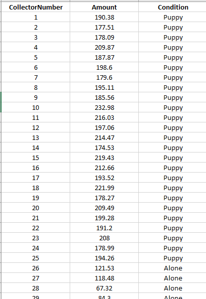

```{r setup, include=FALSE}
library(knitr)

knitr::opts_chunk$set(
  comment = "#>",
  fig.path = "figures/", # use only for single Rmd files
  collapse = TRUE,
  echo = TRUE
)
```

> #### Data Focus
>
> Modules and Handouts 2--6 cover topics that are part of the data analysis journey and are all interrelated to one another. The way that it has been separated is to introduce main topic but then each subsequent topic will add in additional content for previous topics. E.g. we start with data visualisation to introduce the basics of the plotting systems but then each other handout will include extra options and customisations.

\

\


Handout: [Handout 02 - Visualising Data](handout2.html)

Associated Readings:

- [R for Data Science - Chapter 12](https://r4ds.had.co.nz/tidy-data.html)
- [R for Data Science - Chapter 11](https://r4ds.had.co.nz/data-import.html)
- [R for Data Science - Chapter 3](https://r4ds.had.co.nz/data-visualisation.html)


# Tabular Data

In this module we begin to work with complete tables of data, and learn how to make informative graphs. 
We begin by getting our scientific research data into RStudio. Commonly, we first enter our data into Excel for cleaning and organising, and save it out as a csv (comma separated values) file. We then import the file into R for data analysis.   We will provide the csv file to be used with this document.

Note that in this document we are using Base R (the R functions that are automatically available in RStudio). These Base R functions are simple to work with, and are a good way to get familiar with R. In later modules, we will meet some more sophisticated R tools which, while more complicated, can also be more efficient.

Work carefully through each of the sections below, confirming that all your outputs match ours. When you feel completely comfortable with the content, move on to R for Data Science: Data Visualisation (https://r4ds.had.co.nz/data-visualisation.html) which covers advanced plotting with the ggplot library.

When you have completed this module, you should be ready to produce the graphs and figures you will need for your in-course research projects. If you run into any problems or have any questions, email us, and/or come to the drop-in session Monday 10.00 to 12.00 in the Science Library Seminar Room.


## Preparation - Do this very carefully

Document organisation is vitally important. We suggest that you keep a separate folder for each R4SSP module. To do this, you can set up a formal RStudio project (see for example https://support.rstudio.com/hc/en-us/articles/200526207-Using-Projects). But if you don't feel quite ready for that, you can just collect your script file and data files together in a folder. Proceed as follows:


1. Launch R Studio

2. Following the procedure from **Using a Script File** in Module 2 - Get Started with R, create a script file and save it to your desktop or other location where you will be able to find it.

3. Quit R Studio

4. Locate the script file you just made (it will have a .R file suffix). 

5. Create a new folder (name it something sensible) and place the script file in it.

6. Retrieve the sample csv data file used in this module from the course Google Drive shared folder ^[https://drive.google.com/drive/folders/1ttf1s8-vkJNOlHdphfi2zFyMq6gGEvCy?usp=sharing]. Place the csv file into the folder with your script file.

7. Open the folder and double-click **on your script file** to open it in RStudio.

If you set things up this way, RStudio will be able to find your data file for the next step -- importing data.


## Importing a data file

The provided file **r4ssp_donations_data.csv** contains the (fictitious) results of a study designed to explore the factors which affect donations to street-corner charity collectors. Fifty student researchers each spent four hours at one of 50 randomly selected positions on George Street, collecting donations for *Blind Low Vision NZ Guide Dogs*, an organisation that raises and trains service dogs. Twenty-five of the collectors were accompanied by guide dog puppies; the other 25 were alone. Assignment to the Puppy or Alone conditions was done randomly. Each researcher recorded the total amount of money collected during their four hour shift. The start of the data file is shown below.

```{r, fig.align='center', out.width = "50%", fig.cap = "Donations - Puppy or Alone", fig.pos = "H", echo = FALSE}

```


We will import this file into R for some preliminary data analysis.

To import a csv file into R we can use the function `read_csv`. Like the R functions we used in Module 2, `read_csv` accepts an argument between its round brackets. The argument is the name of the input file. Because the name of the file is a string, we surround it with double quotes. We will therefore say:

`read_csv("r4ssp_donations_data.csv")`

However, we are not quite ready to run this command. The function `read_csv` is not part of base R (the R functions that are automatically available in RStudio). It is part of a **library**, a set of additional functions that can be loaded into RStudio. Function `read_csv` is part of the **readr** library, and we load it with the `library` command. We will therefore need two lines of code:


`library(readr)`

`read_csv("r4ssp_donations_data.csv")`

Note that you only have to execute `library` once each time you open RStudio. After loading a library, it is available for the remainder of your R session (i.e. until you quit RStudio) and you can call its functions as normal.

## Import and check your data

Type the following lines into your script file. Execute your commands as you did in the previous module.

```{r read_csv}
library(readr)
read_csv("data/r4ssp_donations_data.csv")
```

NB: When you try to execute this code, you may receive an error message: *Error in library(readr) : there is no package called ‘readr’*. If this happens it means that the functions in library readr have not yet been installed on your computer. Please see **Appendix 2 - Installing Packages** at the end of this handout for instructions.

When imported into R, the data from the csv file are stored in an R object called a **tibble**. A tibble is a slightly enhanced version of a core R object called a **data frame**. Tibbles and data frames are simply tables, organised into rows and columns. The columns have names, and each row of the csv file becomes a row in the data frame. 

When you call `read_csv`, passing in a file name, R reads in the file, converts it to a tibble, and displays it in the console. The columns have the same names as in the csv file. We will see later that we can use the column names to explore specific properties of our data set.

R also gives you some information about how it understands the contents of the file it has imported. In the console you will see the words **Parsed with column specification:** followed by a list of the imported columns. 

Each column header is associated with a value **col_double()**, or **col_character()**. These indicate what kind of data R identified in the input file. Columns that are **col_double** are numbers; columns that are **col_character** are strings. The same information is shown where RStudio prints the imported data. Beneath each column header you will see **dbl** for numbers and **chr** for strings. 

This is a good moment to pause and check that your data have been imported correctly. Data entry errors can cause R to make the wrong assumptions about your data. If you have a column of numbers that contains even one accidental alphabetic character (typos do happen) R will consider the whole column to be strings. Later, R will give the wrong results when you perform statistical analyses on these data (or it will refuse to perform them at all).   

You will often also see files imported with the function `read.csv` (note the . instead of the _ ). This is the base R function for importing files. To use `read.csv` you don't need to load a library first, but R doesn't generate any information about how it has parsed the data in the columns. You can use the function `str` to get this information. Google for details.

With both `read_csv` and `read.csv` R will import the file and display its contents in the console, but this is not quite enough. We want R to store the data in a named variable so that we can refer to it later (i.e., do analyses on it). We do that with the assignment operator, as we did in our previous module. For example, we can say:

`puppy_donations_data <- read_csv("r4ssp_donations_data.csv")`

Then, we can refer to this whole dataset any time with `puppy_donations_data`.

Enter and run these commands:

```{r load_data}
# Load the library before the first time you call read_csv
library(readr)

# Read a csv file into R. Store the result in a named variable
puppy_donations_data <- read_csv("data/r4ssp_donations_data.csv")

# As always in R, we can display the contents of a variable by simply typing its name.
puppy_donations_data

```


## Perform descriptive analyses on columns

It is always informative to begin data analysis by inspecting your dependent variable (in this case, amount of money collected). Work through each of the following steps, adding the code to your script file (and remember to **Save Often**).

To select a single column from a data frame, we apply the **$** operator to the data frame, and specify the column name. The output is a **vector** containing the values in the named column.

```{r selectColumn}

# Select a single column with $ and the column name
puppy_donations_data$Amount
```

To simplify our later typing, we can use the assignment operator to save the output into a named variable.

```{r saveColumn}
# Save a single column into a variable
amount_only <- puppy_donations_data$Amount

# Display the variable
amount_only
```


We can now apply R's many, many statistical functions to our variable.


### Simple plots - the histogram

First, let's plot a histogram of the amounts collected, (ignoring the Puppy/Alone condition), to get a quick sense of how much people are donating. We generate this graph with function `hist`. The graph will be displayed in the Plots tab of RStudio's lower-right pane.

```{r 02-hist}
hist(amount_only)
```
Our data appear to be bimodal (i.e. they have two peaks). This pattern can indicate the presence of distinct groups in a data set, an informative result in this study. 


### Simple numeric descriptive statistics

We can also generate some useful numeric summaries:
```{r someStats}
# Compute the mathematical mean with function mean()
mean(amount_only)

# Compute the standard deviation with function sd()
sd(amount_only)

# Get a selection of distribution descriptors with function summary()
summary(amount_only)
```

There are, literally, hundreds of interesting functions in R for performing summary analyses. Sadly, we do not have time to cover them all, but we encourage you to explore R textbooks and online resources to learn more about them.


### Boxplots
We can see that the mean amount is higher for collectors who had puppies than for those who did not ($197.79 vs. $102.30). We can illustrate this difference graphically using a boxplot. 

The R function `boxplot` accepts two arguments. 

The first argument is the **formula**. This is a complex, yet very common, argument format for R statistical functions. The formula describes a linear model for a data set with the general structure: **dependent or predicted variable ~ independent variables or predictors**, using columns names from the data frame. The ~ (tilde) is read as "depends on" or "is predicted by". For our example, we are interested in the way that Amount is dependent on the Puppy/Alone condition, so we specify our formula as **Amount ~ Condition**.  We will see more complex examples of the formula argument later in the semester.


The second argument to boxplot is the data frame.

```{r 02-boxplot01}
boxplot(Amount ~ Condition, puppy_donations_data)
```


Boxplots efficiently illustrate both the central tendency and the variability of a data set. Each grey box extends from the first quartile to the third quartile of its input values. The dark line across the box is at the median. The two thin lines outside the qrey box show the values of the minimum and maximum scores, excluding extreme outliers. If extreme outliers are present, they are shown as asterisks.

The `boxplot` function actually has many optional arguments for things like adding legends and formatting plot axes, and calls to this function can get quite elaborate. Because of this, it is common to see the function called with its arguments named (as with stringsAsFactors, above). For example:

```{r 02-boxplot02}
boxplot(formula = Amount ~ Condition, data = puppy_donations_data)
```

## GGplot2

```{r}
library(ggplot2)
```


# Conclusion

This document has presented a simple introduction to working with complete tables of data in R. We learned how to import a csv file into a data frame, how to select columns and rows of interest from the data frame, and how to perform simple, yet illustrative summaries on them. We have covered only a tiny fraction of the data analyses you can perform with R and RStudio. You can also do very complex statistics like ANOVA, regression, factor analysis, and complex modelling. The specific statistical analyses you will need to do for your in-course assignments will depend on the papers you are taking, but you can be confident that whatever your lecturers require can almost certainly by done efficiently in R. As we proceed through the semester, if you wish to discuss a particular data analysis, processing, or presentation task, please let us know.


## What's Next

Fill in the module feedback form [https://tinyurl.com/r4ssp-module-fb](https://tinyurl.com/r4ssp-module-fb).

Ensure you have the `tidyverse` package installed. Refer to Appendix 2, or [https://r4ds.had.co.nz/introduction.html](https://r4ds.had.co.nz/introduction.html) for how to do this.
 
Next, move onto Section 3 - Data Visualisation in the online text "R for Data Science" (https://r4ds.had.co.nz/data-visualisation.html). This material covers **ggplot**, the industry-standard graphics package for R. Be prepared: The ggplot syntax is probably different from anything you have used before, and it can take a little getting used to. But be patient, because with ggplot you can produce publication-quality plots and figures that will definitely enhance your own research project reports. As always, if you run into trouble, let us know.


# Appendix

## Manual Data Entry in R

For extremely small data sets, you can manually enter tabular data into R. You create a vector for each data column using the combine function `c`, and then collect those vectors into a data frame:

```{r manual data 1}
countries <- c("Austria", "Brazil", "Canada")
capitals <- c("Vienna", "Brasilia", "Ottawa")
population_in_millions <- c(9, 211, 38)

geography_df <- data.frame(Country = countries,
                           Capital = capitals,
                           PopulationMillions = population_in_millions)

geography_df
```


## Installing Packages

When R is installed, it comes with a large set of commands, data structure, and functions which are together known as **base R**. Over the years, researchers and programmer have written thousands of additional functions and modules (called **libraries**) that you can use in your own R code. This **third-party code** is checked by moderators and, if it passes inspection, loaded onto an official R server in a file structure called a **package**. To use packages, you must first download them to your computer. They are placed in the same folders where base R was originally installed. 

To access the functions in a package in your R code, you load the package using the `library` command, as we saw above with **readr**. You only need to download a package one time on any machine, but the `library` command must be executed at the start of each RStudio session (i.e. every time you launch RStudio).

To install a package, use the `install.packages` command passing the name of the package as the function argument. The name is a string **so must be surrounded by double quotes**. To use an installed package, use the `library` command, passing in the name of the package. Now that the package has been installed, R recognises it as an entity (like a variable) so you do not put double quotes around the package name in the library command.

For example, when you want to use function `read_csv`, contained in library **readr**:

```{r getting readr, eval = FALSE}

# Download the reshape2 code to your machine
install.packages("readr")


# Load the library for the current session
library(readr)
```

### Tidyverse

The tidyverse is a collection of packages (metapackage) that are an (opinionated) way of performing analysis in R and are all designed to operate nicely together. When `tidyverse` is installed it actually is a wrapper that installs the individual packages that make up the tidyverse core.

The tidyverse consists of a core set of packages to perform common tasks in data analysis and are `ggplot2` (plotting), `dplyr` (data manipulation), `tidyr` (data tidying), `readr` (data importing), `purrr` (functional programming), `tibble` (a special type of data frame), `stringr` (common tasks for string manipulations), and  `forcats` (dealing with factors)


```{r install tidyverse, eval = FALSE}
# Download and install the packages of tidyverse
install.packages("tidyverse")
```


```{r}
# load the tidyverse packages for the current session
library(tidyverse)
```

### R for Data science extra packages

If you are following along with R for Data Science make sure you have these packages installed:

- nycflights13
- gapminder
- Lahman

```{r, eval = FALSE}
install.packages(c("nycflights13", "gapminder", "Lahman"))
```


