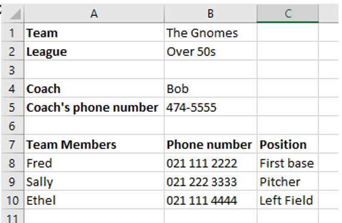
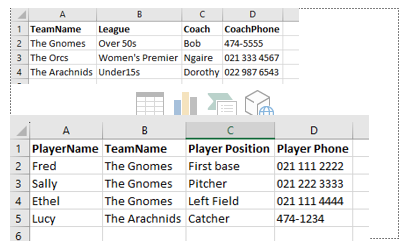
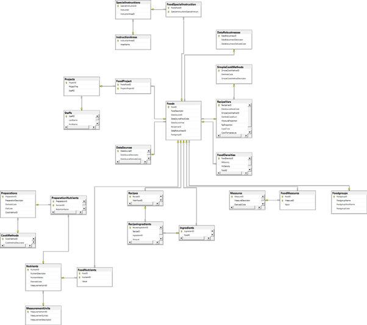
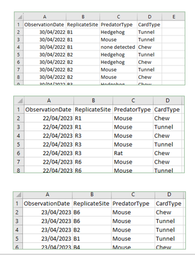
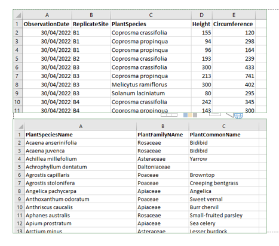

```{r setup, include=FALSE}
library(knitr)
library(tidyverse)
knitr::opts_chunk$set(
  comment = "#>",
  fig.path = "figures/07/", # use only for single Rmd files
  collapse = TRUE,
  echo = TRUE
)
```

> #### Associated Material
>
> Module: [Module 07 - Combining data](07-combine.html)
>
> Readings
>
> - [R for Data Science Chapter 13](https://r4ds.had.co.nz/relational-data.html)


## Combining Data
So far, each data set we have worked with has been contained in a single monolithic data file with all variables as columns and all observations as rows. In a real reserach situation, this will not always be the case. Complex data sets are often deployed as multiple related files. Each file represents a single, well-defined data entity, and the relationships between entities are part of the data provided. In order to answer our research questions, we need to be able to combine these different files in various, sometimes complex ways.


## Describing the Data Universe
The complex systems we study generally consist of many different **entities** ("things", like participants, test results, experimental conditions, species, researchers, equipment, lakes, etc.). Each entity has important **properties** (e.g. subject ID, reaction time, equipment type, etc.). There are complex **relationships** between entities (e.g. a particular participant was given a specific experimental treatment, a particular animal species was seen in a specific lake). Together, these constitute our **data universe**.

To answer our research questions, we need to be able to represent the data universe in an organised way. The challenges this imposes can be seen even in comparatively simple contexts. 

For example, assume you are involved with the local softball competitions. There are multiple leagues, each league has multiple teams, each team has a coach and many players. Your job might be to maintain contact information so that people can be informed when there are changes to the game schedule.

As an experienced computer user, you can decide to put all this informtion into some nice spreadsheets. For example, you might have a spreadsheet like this for one team:

```{r, fig.cap = "The Gnomes", echo=FALSE, fig.align='center', out.width="100%"}

```

You would have a comparable spreadsheet for each team in each league. 

If your data only need to be available to people, this system would probably be adequate, if a little cumbersome. However, if you wanted to load your data into a computer for processing, this file format will not work. Recall that R needs a rectangle of data with column headers across the top and one row for each data point. You couldn’t even import your data using this "human-friendly" spreadsheet.

To provide the same information in a format that a computer can understand, you must do the following:

1. Identify the cohesive entities in your data
2. Identify the properties for each entity
3. Make a separate file for each entity
4. Make the relationships between entities explicit in their data (see examples below).

In our Sports League example, we see that we have two clear entities -- Teams and Players. A Team has four properties: the name, the league, the coach, and the coach's phone number. A Player has four properties: their team, their name, their phone number, and the position they play. In our current format, Teams and Players are all mixed into the same file. For the computer, we need to separate them. Making each property a column, and each instance a row, we can reformat our data into two separate files, like this:


```{r, fig.cap = "Sports League for Computers", echo=FALSE, fig.align='center', out.width="100%"}

```

Note that these files are in exactly the rectangular "rows are instances; columns are variables" format that R requires. You can easily read them into R and start processing them. For example, if there are 800 players in the Players spreadsheet, how would you determine the number of players assigned to each position, across the entire league?

Assuming you have used `read.csv` to import the Players spreadsheet into a dataframe `players_df`, you could say:
`players_df %>% group_by(PlayerPosition) %>% count()`.

By making two separate spreadsheets, you have separated the information about players from the information about teams. It is essential that, when your data are reorganised in this way, no information has been lost. That is *can you answer the same questions with this arrangement as you could with the original one?*

For example, with the first human-friendly version, it is easy to answer *“Who is Fred’s coach?”*, because Fred and his coach are in the same spreadsheet. But how do you do it with the computer-friendly organisation where Fred's data and his Team's data are in different files?

As a person you would say “Fred’s team is The Gnomes (from sheet 2) and Bob is the coach of The Gnomes (from sheet 1) therefore Bob is the coach of Fred.” To do it in R (as you would if you needed to perform this operation for 800 players) you would select the TeamName value for Fred in the Players file, then filter for that value in the Teams file and select the Coach column. After you learn how to write loops, you could loop through all the players and do this computation, accruing the results into a vector. Then you could add that vector as a new column somewhere to match up player and coach. However, R provides much more succinct ways to perform this operation.

This is fortunate, because real research data sets are often deployed in many more than just the two files we needed in our toy Sports League example. Large, complex data sets are typically not managed with spreadsheets at all, they are managed as **databases**. While this term is used quite broadly in casual discussion, it technically refers specifically to **Relational Database Management Systems**, special applications that are optimised for searching, deleting, filtering, and generally managing huge amounts of data.

In an RDBMS each **entity** has its own **table** and the tools have EXTREMELY strict rules about the contents and structure of their entities. The data universe is broken down into atomic pieces of data and recombined through the rules of a mathematical framework called the Relational Algebra. It is a beautiful thing, but you end up with a lot of tables.

The figure below is an **Entity Relationship Diagram**. It shows the structure of the database for a *relatively simple* database system that keeps track of Food Diaries – where people record what they eat for nutritional analysis. 


```{r, fig.cap = "Example ERD", echo=FALSE, fig.align='center', out.width="100%"}

```


When real data are exported to you for processing, therefore, you can end up with a lot of separate files. Using R, you have to be able to recombine data as needed to answer your specific research questions.


## Simple Combining (Binds)

Before we look at the sometimes complex issues around combining tables representing different entities, we will quickly cover two simpler combining situations that occur when you have, essentially, a single table that has been broken into multiple input files. 

Our data for today come from the **Geckos and Gumboots** project. Geckos and Gumboots is a multi-year, multi-disciplinary reconstruction of wild New Zealand Gecko habitat on the Otago Peninsula (South Island, New Zealand). A large area of land on the peninsula has been planted with native gecko habitat species, divided into replicate quadrats and, at intervals, data are collected about plant growth, and invertebrate, predator, and gecko population abundance. Undergraduate students participate in data collection and analysis to gain experience with ecology fieldwork.


### Combining Rows

Assume the field ecologists have sent you some predator observation data for analysis. They have sent you three separate csv files, one for each of three data collection days.


```{r, fig.cap = "Combining Rows", echo=FALSE, fig.align='center', out.width="100%"}

```

All three files have exactly the same format – four variable columns and one row for each recorded predator observation. This is a nice way to get data – everything is already rectangular, and they have all the same columns in the same order. You simply need to gather them all up into a single dataframe – in R this is straightforward. Use function `rbind`, passing in all the data frames to be concatenated, separated by commas.

```{r rbind}
pred_01_df <- read.csv("data/predator_observations_2022_04_30.csv")
pred_02_df <- read.csv("data/predator_observations_2023_04_22.csv")
pred_03_df <- read.csv("data/predator_observations_2023_04_23.csv")

pred_all_df <- rbind(pred_01_df, pred_02_df, pred_03_df)
pred_all_df[50:60,]
```

Note that if the arguments to rbind don't all have exactly the same columns, the function will, quite sensibly, throw an error:

```{r rbind error, error=TRUE}
# For purposes of illustrion, we drop the 4th column from pred_01_df
pred_01_df <- pred_01_df[ , -4]

# The rbind command now fails
pred_all_df <- rbind(pred_01_df, pred_02_df, pred_03_df)

```

### Combining Columns

Less commonly, you might have multiple data sets with the same rows (obervations), but different columns (dependent and independent variables). In this case, use function `cbind` -- the syntax is the same as for  `rbind`. 

In practice, this situation actually occurs very rarely. This is fortunate, because column binding is extremely risky. Column binding relies entirely upon the rows in the separate data frames being identical and in the same order; the function itself performs no checks on this constraint. 

Because of the danger of mixing up data from different observations, I only use cbind when I am generating columns dynamically (in code) and wish to build a data frame from them.

  
## Relational Combining (Joins)

Recall our Sports League data:

```{r, fig.cap = "Sports League for Computers", echo=FALSE, fig.align='center', out.width="100%"}

```

Our "research question" was how to find the name of Bob's coach. More generally, assume we want to know the coaches of all the players. When working with data frames, this means we want to add columns to the Player's table that contain the associated coach information for each row.

We noted that the Team table and the Player table have a common column – TeamName – and that we could match players and coaches by looking for matching values of TeamName. This is a requirement for relational combining -- two tables must share a common column (or columns) that can be used to match observations betwen the tables. These common columns are called **keys**. 

In formal databases, there are lots of rules about keys, particularly around **uniqueness**. Note how confusing it would be if there were *two* rows in the Teams data frame with teamname *The Gnomes* – which of the two coaches would you want to match with Fred? ^[NB: There is a method for dealing with the "multiple coaches" problem, but it is out of scope for today's module. Ask me for more detail if you're interested.] For today we will assume that these requirements are met – for further details, see the R for Data Science chapter.

## Join

In database terminology, the process of matching up records from multiple tables is called a **join**. R (more specifically tidyverse) uses this terminology as well.  Solving problems like finding the coach for each player involves joining two or more data frames on one or more common columns.

To slightly complicate things, R does not provide a function called “join”.  It provide *six different functions* which perform slightly different types of join operation. The function names are derived from the formal database terminology. Fortunately, in the vast majority of cases we encounter, you only need one of the join family -- `left_join`. We will cover `left_join` here; see the additional readings for discussions of the less common forms.

The function `left_join` takes as arguments the two tables (data frames) you wish to join. The name `left_join` helps you to remember how to order your arguments – put the **base table** on the left (i.e. as the first argument). The **base table** is the one you wish to add columns to.

Recall that we wanted to know each player’s coach. We therefore want to add a CoachName column to the Players data frame. Thus Players is the **base table**. We pass it first into function 'left_join', along with the name of the **key** column.


```{r make df, echo = FALSE}
teams_matrix <- cbind(TeamName = c("The Gnomes", "The Orcs", "The Arachnids"),
                  League = c("Over 50s", "Women's Premier", "Under 15s"),
                  Coach = c("Bob", "Ngaire", "Dorothy"),
                  CoachPhone = c("474-5555", "021 333-4567", "022 987-6543"))
teams_df <- as.data.frame(teams_matrix)

players_matrix <- cbind(PlayerName = c("Fred", "Sally", "Ethel", "Lucy"),
                        TeamName = c("The Gnomes", "The Gnomes", "The Gnomes", "The Arachnids"),
                        PlayerPosition = c("First Base", "Pitcher", "Left Field", "Catcher"),
                        PlayerPhone = c("021 111 2222", "021 222 3333", "021 111 4444", "474-1234"))
players_df <- as.data.frame(players_matrix)

```


```{r join_01}
# We need the tidyverse to be able to join
library(tidyverse)

# Assume we have imported out sports league data using read.csv
head(teams_df)
head(players_df)

# Perform the join
extended_players_df <- left_join(players_df, teams_df, by = "TeamName")

# The new data frame
extended_players_df
```

The new dataframe has all the columns in Players, in the original order. It also has all the columns in Teams, in the original order. For *each row of Players* (the base table; the one on the left), the values of the Teams columns are taken from the row in Teams that has the same value in column TeamName (the key).

### Exercise

What output do you expect if you reverse the order of `players_df` and `teams_df` in the call to `left_join`, above? Try to think through this exercise before testing the code. Hint: When you reach the point where you say "but that doesn't make sense!", recognise that the computer will be in the same situation.

## Practice Joining

The Geckos and Gumboots project provides information about the plants observed growing in each quadrat (resource file *plant_observations.csv*). In a separate file, they provide additional information about plant species (resource file *plant_species.csv*). This mirrors the structure of the database, where these entities are stored separately to allow efficient data operations and complete representation of the data universe (e.g. to allow information to be stored for plant species that have not yet been observed, but which are expected to be in the future).

```{r, fig.cap = "Plant Observation and Species Data Input Files", echo=FALSE, fig.align='center', out.width="100%"}

```

**Your job**: Produce a new data frame that adds family and common names for each plant observation.

```{r plant join solution}
# Load the input data frames
plant_obs_df <- read.csv("data/plant_observations.csv")
plant_species_df <- read.csv("data/plant_species.csv")

# Perform the join
extended_plant_obs_df <- left_join(plant_obs_df, plant_species_df, 
                                   join_by(PlantSpecies))

# Display a section of the result
extended_plant_obs_df[55:65,]
```

## A Complete Research Question

Package `nycflights13` contains several data frames which hold historical data about airplane flights in and out of the several airports in New York city. There is one table for each important entity. Each table contains entity properties, and relation information.

- airports: Airport FAA code, name, latitude, longitude, time zone, etc. for each airport
- planes: Tail number, year of manufacture, and technical specification for each plane
- airlines: FAA code and company name for each airline
- flights: Date, departure and arrival times, plane information, distance, airline code, etc. for each flight


**Your job**: Determine which airline flew the total greatest distance using single engine planes.

**Hint**: Do not start typing code yet.

With any but the simplest problems, you should always make a plan *before* you start coding. Remember that computers need to have **every single step** laid out for them, and in ways they understand. It is often difficult to work out exactly what those steps should be.

Our intial plan might be:

1. Find all the flights made by single engine planes
2. Add the distances up for each airline
3. See which is the largest.

But this plan is not sufficiently detailed for the computer. How, for example, will you tell the computer to determine which flights were made by single engine planes? The `planes` data frame contains the number of engines for each plane, but the `flights` data frame does not -- it contains only the flight number (column `flightnum`). Fortunately, `planes` also contains `flightnum` so we can use that column as a key to join the two tables.

Our computer-friendly plan:

1. Join `flights` and `planes` with flights as the base and `tailnum` as the key to add the plane information for each flight.
2. From the resulting extended flights data, select those with only one engine (i.e. field engines == 1)
3. The flights table contains column `carrier` to identify the airline. Use group_by and summarise to compute the total `distance` grouped by `carrier`.
4. Pick the largest


Now you are ready to write your code:

```{r flight distance}

library(nycflights13)

# 1. Join `flights` and `planes` with flights as the base and `tailnum` as the key to add the plane information for each flight.

flights_planes <- left_join(flights, planes, by = "tailnum")

# 2. From the resulting extended flights data, select those with only one engine (i.e. field engines == 1)

single_engine_flights <- flights_planes %>% filter(engines == 1)

# 3. The flights table contains column `carrier` to identify the aireline. Using group_by and summarise compute the total `distance` grouped by `carrier`.

carrier_distance <- single_engine_flights %>% group_by(carrier) %>% summarise(TotalDistance = sum(distance))

# 4. Pick the largest

# Sort descending
carrier_distance <- carrier_distance %>% arrange(desc(TotalDistance))

# Display
carrier_distance


```

This is close, but what if you don't know what B6 stands for?. Recall that data frame `airlines` contains carrier code and full name. To improve your analysis clarity, extend your `carrier_distance` table to include the full airline name. What operation will you perform? What arguments will you provide?

```{r airline name}
left_join(carrier_distance, airlines, by = "carrier")
```

You have now established that JetBlue Airways flew the greatest total distance using single engine planes.
