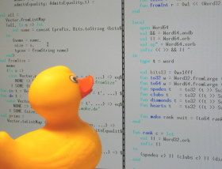

  
```{r setup, include=FALSE}
library(knitr)

knitr::opts_chunk$set(
  comment = "#>",
  fig.path = "figures/09/", # use only for single Rmd files
  collapse = TRUE,
  echo = TRUE
)
```

> #### Associated Material
>
> Zoom Notes: [Zoom Notes 09 - Workflows](zoom_notes_09.html)


## Introduction

In this module we're going to cover some ways to improve your workflow as you use R. As you develop your understanding of R and proceed to do fancier things, you'll want to start bringing in extra features to make your life easier. When we think of a workflow there are three main phases we undertake. At the very beginning we're setting ourselves up, establishing how things will be organised, and how we intend to work. Second, we do the work - which involves testing and adjusting the established systems, and lastly, we wrap things up.

## Getting organised

In the first module we discussed creating a structure for your work inside an RStudio project. For both analysis and programming projects it is useful to have a pre-established 'go-to' template structure to keep things organised.

An overarching principle is "keep similar things together". For an analysis project, this can mean the structure we first covered when setting up an RStudio Project:

```
My_Project/
  |- data/
  |- docs/
  |- output/
  \- scripts/
```

Beyond the structure of where we put things. We also want to establish the the principles of how the project will operate. Two important files in this regard are the README and the LICENSE. The README will tell yourself and others important details about the project such as where the source data came from, or how to run the code in the project (e.g. order of scripts). Secondly a LICENSE - this will become important later on when code you have written may be released for others to see (e.g. as part of a research paper) as it will set out the rules under which people may use your code.

### Licensing

When we're dealing with research, by and large we're operating in an "open source" manner - i.e. the code that is used to perform the research is shared alongside the results so that people can view it. Just because the code is available doesn't mean that people get to do what they like with your code though. 

It's always a good practice to add a license to go along with your code. A license is a document that lets people who come across the code what they allowed to do with it, and what they're not. There are many open source licenses available and they vary in what behaviours they permit or restrict. When choosing an open source licence there are 3 main questions you need to answer:

1. Do you care about how any modifications that people make to the code are distributed?
2. Do you or your institution own any related software patents?
3. Do you care about the way your name is or isn't mentioned when someone makes use of your code?

An extremely common license in research code/software is the MIT license which is the simplest and most permissive, essentially says the code is "as is" without any warranties, and lets people use, copy, modify, and distribute your code so long as the copyright notice goes along with it (i.e. for attribution purposes). For help selecting an appropriate license have a look at [https://choosealicense.com](https://choosealicense.com).

### The `usethis` Package

The `usethis` package is designed to assist in the creation of new packages and setting up of new projects. It is is an extremely useful package for several "workflow" tasks. It provides functions for many common workflow tasks such as creating new projects, adding README files, or opening R files. 

```{r, eval = FALSE}
# Create and open a new package
usethis::create_project(path = "path/to/new/project")

# Create a markdown README
usethis::use_readme_md()

# Create an RMarkdown README
usethis::use_readme_rmd()

# Create a new R script in your project in directory R/
usethis::use_r(name = "myfile.R")


```

On top of these, there are many other helper functions, such as for creating various licenses, editing configurations, interacting with version control software, or setting up automatic testing. All of which we'll touch on in this module.


Once you have chosen an appropriate license, `usethis` likely has a template ready to go. e.g. `usethis::use_mit_license()`.

### Configuration

As part of the set up stage, we're also wanting to make things easier on ourselves to that we can be more productive during the "do stuff" stage.

There is a hidden file called .Rprofile which is loaded as R launches and is a place where you can place customisations of options to make your R life easier. For instance I have mine set to automatically load workflow helper packages such as `usethis` `testthat` and `devtools`. And set a few options to make R produce more warnings so that it helps me know when something might cause an issue. It's also a good place to set some defaults such as your favourite CRAN mirror so that R doesn't need to ask you when you go to install packages.

```{r, eval=FALSE}
usethis::edit_r_profile()
```


```{r, eval=FALSE}
 # load workflow helper packages if in interactive session
if (interactive()) {
  suppressMessages(require(devtools))
  suppressMessages(require(usethis))
  suppressMessages(require(testthat))
}


# set CRAN
options(repos = c(CRAN = "https://cloud.r-project.org/"))


# warn on partial matches
options(
  warnPartialMatchArgs = TRUE,
  warnPartialMatchDollar = TRUE,
  warnPartialMatchAttr = TRUE
)

# fancy quotes are annoying and lead to
# 'copy + paste' bugs / frustrations
options(useFancyQuotes = FALSE)
```

Don't put analysis modifying options into your .Rprofile e.g. automatic loading of `tidyverse`. It will make the code you write less reproducible because it will start depending on these hidden settings, and it can make debugging harder.

#### keyboard shortcuts

The keyboard shortcut to rule them all: <kbd>Alt</kbd> + <kbd>Shift</kbd> + <kbd>K</kbd>

Other useful shortcuts

Keys | produces
---|---
Ctrl + Shift + M | %>%
Alt + - | <-
Ctrl + Shift + K | knits Rmd
Ctrl + Shift + F10 | Restart R
Ctrl + Alt + I | Insert code chunk
Ctrl + Shift + S | Source active file
Ctrl + . | Go to file/function

Make your own...

Tools -> Modify Keyboard Shortcuts

### Scripts

Establish the structure of how you want to capture your code. Are you going to do everything in Rscripts? RMarkdown? A combination? Create the appropriate script files. It can be useful to have a separate Rscript where you store functions that you create which can be 'sourced' into your other scripts through `source("scriptname.R)`.


### Initialise Version Control

This section is a very brief overview of version control, specifically to say that you should start to build it into your workflow and we'll touch on it again in the [Automating Version Control](#auto-vc) section.

You are likely familiar with versioning, usually people try to achieve this through file names. This is ok to a point but can cumbersome and doesn't scale well across multiple files nor does it give you an easy way to see exactly what the differences were between those files. This is where using version control software such as `git` can make your life easier.

It's always a good idea to get this set up before you get underway doing actual work so that you can track you changes from the the very start. In the case of `git`


https://happygitwithr.com


## Testing and Adjusting


### Debugging

Errors messages are common when coding and are a way the computer communicates it doesn't understand what the instructions it has been given are.


```{r, echo = FALSE, out.height = '50%', out.width='50%', fig.cap = "https://xkcd.com/1739/"}
knitr::include_graphics("images/09-fixing_problems.png")
```

Some general good advice can be found in https://adv-r.hadley.nz/debugging.html with some specific tips and tricks for R.

#### Where do I start?

> Finding your bug is a process of confirming the many things that you believe are true — until you find one which is not true.
> —Norm Matloff


```{r, echo = FALSE, out.height = '50%', out.width='50%'}
knitr::include_graphics("images/09-effective_techniques.png")
```


Rubber Duck debugging

```{r, echo = FALSE, out.width = '50%', out.height = '50%'}

```


#### General process

My general process focuses on the initial source of the error and then starts to work backwards in command history.

1. Do I recognise the message?
2. Re-look at the command I ran looking for
    - typos
    - missing syntax (e.g. brackets, semicolons, etc.)
    - correct naming of things
3. Is the input for my command what I expect it is?
4. Did the previous command run properly?
    - if not jump to 1. for the previous command

```{r, echo = FALSE, out.width="50%", out.height="50%"}
knitr::include_graphics("images/09-changingstuff.jpg")
```

#### Getting to know some errors

Lets look at a few common R errors and warnings so that we can become more familiar with a) what they look like, b) how to find the useful bits, and c) demonstrate some techniques.

```{r, eval = TRUE, error = TRUE, warning = TRUE, results='hide'}
my_var

mean[2]

a <- c(one = 1,two = 2, three = 3)
a$one

a[[20]]

read.csv("myfile.csv")

ggplot()

notapackage::notafunction()


if(NA){
  print("was NA")
}


if(c(3 > c(1,2,3))){
  print("less than three")
}

if(c(1,2,3) > 3){
  print("less than one")
}

mean(c("1", "2"))
```


#### Asking/searching for help

- Effective googling
- Stack Overflow
- Minimal Reproducible example
  - https://stackoverflow.com/help/minimal-reproducible-example


### RMarkdown driven dev

https://emilyriederer.netlify.app/post/rmarkdown-driven-development/

### Packages

## Automating

As you go about developing, there are two main things you will find yourself doing over and over again - trying to remember what you have changed, and making sure that any changes haven't broken anything. These processes can be quite time intensive so it's quite useful to try and automate the pieces that you can.

### Automated testing

As you code and manually test, it can be beneficial to formalise the manual tests into an automated solution so that you can be more efficient and also ensure that you know when you 'break things' with future changes. This is particularly useful when you fix bugs in your code, create a test that replicates the condition that caused the bug.

In R one system uses the package `testthat` which provides a framework to create these formal tests which will evaluate a piece of code against the known expected output and tell you if they don't match.

```{r, eval = FALSE}

# expect a mean of 2
testthat::expect_equal(mean(c(1,2,3)), 2)

```

### Automating differences {#auto-vc}


## Finalise

Congratulations! You've made it to the end-stage of your project where you're ready to wrap things up and share your project with others. What you do at this stage entirely depends on what output your project was for. Perhaps it's sending your entire project directory to your lecturer or supervisor. Or this could involve uploading your version controlled code to an online code repository such as [https://github.com](https://github.com) and publishing the url in your paper or other output.

Regardless, embrace the completion. Then continue on to your next project, bringing with you the skills you learnt on this one.

## Appendix

An example workflow

```{r, eval=FALSE}
# Create and open a new project
usethis::create_project(path = "~/myproject")

# Initialise version control
usethis::use_git()

# Create the project structure
dir.create("data")
dir.create("scripts")
dir.create("output")
dir.create("docs")

# Tell git to ignore the data directory by adding line:
# data/
usethis::edit_git_ignore()


# Add a README
usethis::use_readme_md()

# Add MIT License
usethis::use_mit_license(copyright_holder = "Firstname Lastname")
```


